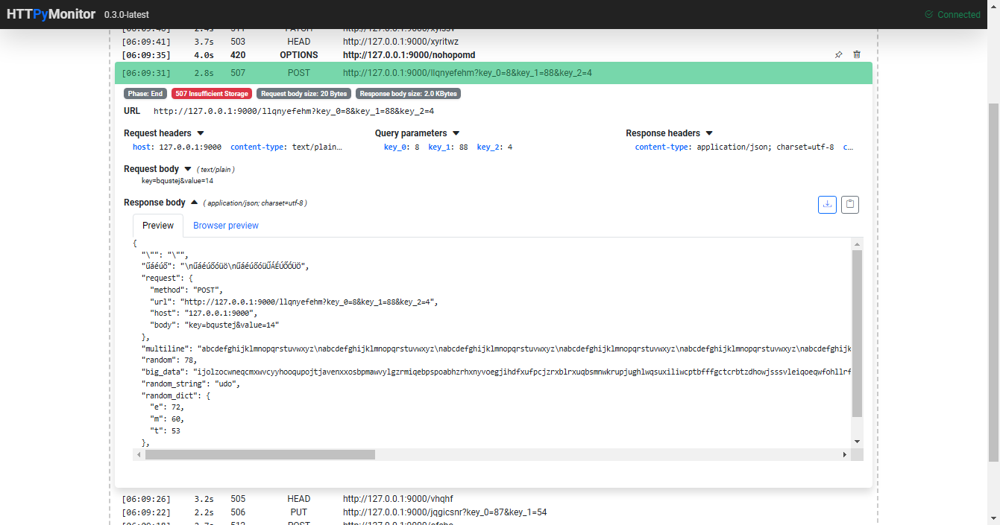

# HTTPyMonitor

Simple HTTP forwarder and monitor with web GUI.



## Topology

```
                                +-----------------------+
                                |    HTTPyMonitor       |
     +-------------+   WS/HTTP  |  +-----------------+  |
     | WEB browser | <-----------> | Webserver (GUI) |  |
     +-------------+            |  +-----------------+  |
                                |          ^            |
                                |          |            |
                                |          v            |
     +-------------+   HTTP     |  +-----------------+  |   HTTP         +---------------------------+
     | HTTP client | <-----------> | HTTP forwarder  | <---------------> | HTTP server (destination) |
     +-------------+            |  +-----------------+  |                +---------------------------+
                                |                       |
                                |+---------------------+|
```

- WEB browser: interacts with the webserver (GUI) via websocket and HTTP.
- Webserver (GUI): provides the graphical user interface for monitoring.
- HTTP client: sends HTTP requests to the HTTP forwarder.
- HTTP forwarder: forwards HTTP requests to the HTTP server (destination).
- HTTP server (destination): The final destination for the forwarded HTTP requests.

## Features

- Forward incoming HTTP requests to a destination
- Monitor incoming HTTP requests
- Web based GUI
- REST API
- Websocket based real-time monitoring
- Docker image
- responsive GUI design

## Usage

```bash
docker run --rm -p 8080:8080 -p 8081:8081 -e PROXY_DESTINATION=https://api.github.com smartondev/httpymonitor
```

This example:

- runs the HTTPyMonitor container in terminal mode
- forwards incoming HTTP requests to `https://api.github.com`
- listens on port `8080` for web based GUI
- listens on port `8081` for incoming HTTP requests
- drop container after stopping

## Docker images versions

- `nightly`: `smartondev/httpymonitor:nightly` (latest)
- `x.y.z`: `smartondev/httpymonitor:x.y.z` (stable)
- `latest`: `smartondev/httpymonitor:latest` (latest stable)

## Author

[Márton Somogyi](https://github.com/kamarton)
